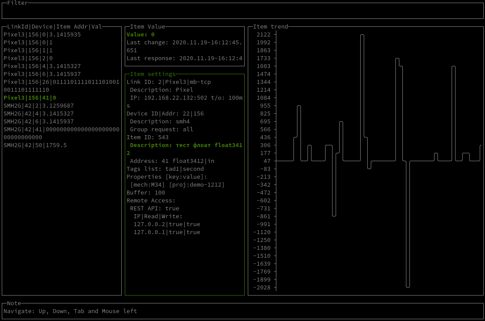
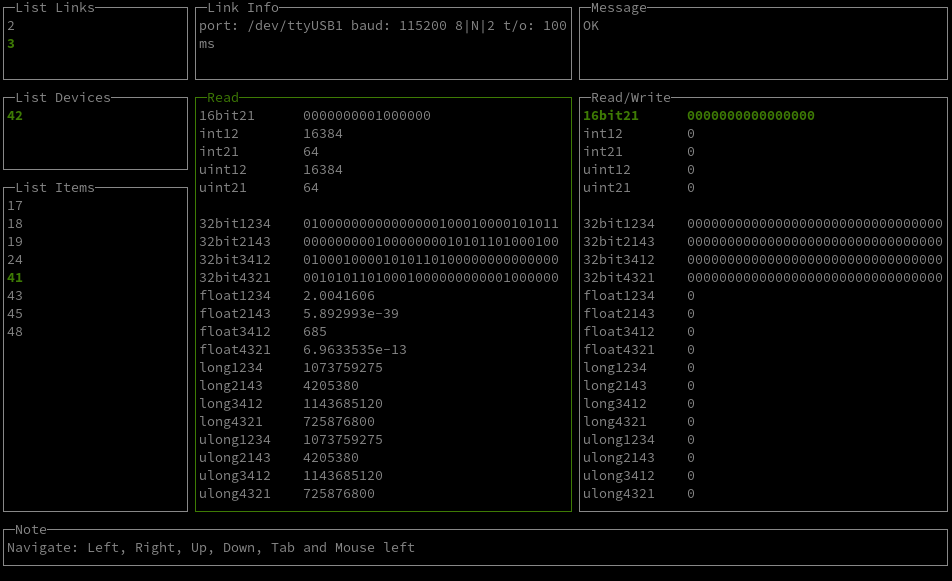

# TEST

----

## --help

        вывод справки

Пример:

```shell
# easymb --help

-config string
        path to config file
-monitor
        monitor modbus variables
-test
        test modbus variables
-version
        display version info
```

## --config

        Путь к файлу настроек приложения

Пример:

```shell
# easymb --config path/to/config/file.json
```

## --monitor

        режим мониторинга

Пример:

```shell
# easymb --config path/to/config/file.json --monitor
```



## --test

        режим тестирования

Пример:

```shell
# easymb --config path/to/config/file.json --test
```



## --version

        информация о версии приложения

Пример:

```shell
# easymb --version

2020/12/15 14:34:52 Version: v0.9-1-g8509443
Commit: 8509443
Date: 2020-12-14.16:47:49.+0700

```
