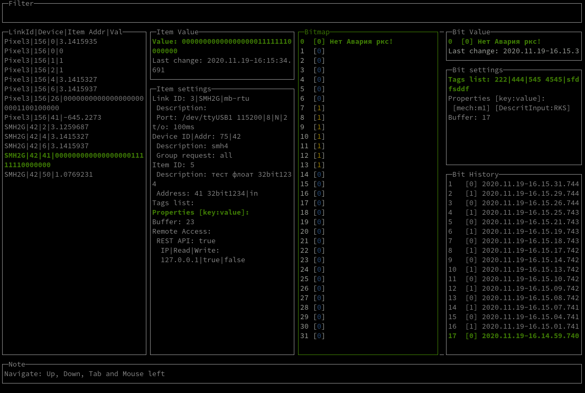

# EasyMB - утилита для работы с modbus

----

## Особенности

### Бесплатная
  
Утилита абсолютна бесплатная и не имеет ни каких ограничений для использования.

----

### Кроссплатформенная

Linux, Windows, ARM.

----

### JSON Конфигурация

Вся конфигурация содержится в удобно читаемом JSON файле(ах*).

----

### Гибкий HTTP API Server
  
* API позволяющий получать и отправлять данные.
* Запрос данных по Тегам и Свойствам переменных.
* Запрос данных по сгруппированных Свойствам переменных.
* Разграничение доступ к переменным по IP.
* Обслуживание статических файлов.
* CORS.

----

### Буферизация данных

Позволяет хранить в памяти исторические данные с указанной глубиной.

----

### Поддержка множества типов данных

bool, int, uint, long, ulong, 16bit, 32bit с различной ориентацией байтов.

----

### Режим тестирования переменных

Консольный интерфейс позволяющий определить корректность адреса и определить тип переменной.

----

### Режим визуализации

Консольный интерфейс позволяющий визуализировать данные переменных и отследить динамику их изменения.

