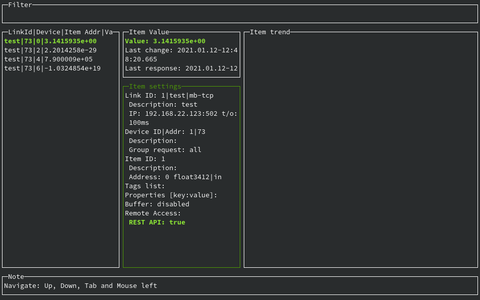

# **Быстрый старт**

----

## **Задача**

Считать данные из устройства по протоколу modbus и отобразить их в веб-браузер

----

## **Порядок действий**

1. Установить связь с устройством и считать данные в соответствующем формате
2. Запустить веб-серевр и отобразить данные

У нас в наличии есть контроллер segnetics **SMH2G** c параметрами связи **modbus-tcp** **192.168.22.123:502** и адресом **73**


который содержит регистры **Input Registers** типа **float** и адресами **0**,**2**,**4**,**6**


Нам достоверно известно что регистр с адресом **0** хранит в себе значение **3,1415**...

### **Установка связи**

В этом нам поможет "тестовый" режим. От обычного режима его отличает упрощенный конфигурационный файл.

В нашем случае он будет называться **cfg.json** и выглядеть следующим образом:

```json
{
    "links": [
        {
            "id": 1,
            "protocol": "mb-tcp",
            "port": "502",
            "ip": "192.168.22.123",
            "timeoutMs": 100,
            "devices": [
                {
                    "address": 73,
                    "items": [
                        {
                            "address": 0
                        },
                        {
                            "address": 2
                        },
                        {
                            "address": 4
                        },
                        {
                            "address": 6
                        }
                    ]
                }
            ]
        }
    ]
}
```

Для проверки из директории где расположена утилита в интерпретаторе командной строки выполним следующую команду

для windows

```shell
easymb.exe --config cfg.json --test
```

для linux(в нашем случае)

предворительно дадим права на выполнение

```shell
chmod +x ./easymb
```

и затем уже

```shell
./easymb --config cfg.json --test
```

Результат выполнения команды должен быть следующим:


Мы видим что у **Link** с **id**=**1** есть **device** c адресом **73** у которого в свою очередь есть 4 переменных с адресами **0**,**2**,**4**,**6**
что в общем то соответствует содержимому файла **cfg.json**.

В этом режиме EasyMB опрашивает все регистры указанные  **links**[x].**device**[x].**items**[x].**address** читая данные по одному и два регистра из **Input Registers** и **Holding Registers**.

После чего все считанные данные с различным порядком байт заполняют столбцы **Read**(**Input Registers**) и **Read/Write**(**Holding Registers**)

В левой части столбцов мы видим тип данных а в правой данные соответствующие этому типу.
Цифровой постфикс типа данных определяет порядок расположения байт.

М так мы убедились в том что наша "контрольная" переменная с адресом **0** действительно находится в **Input Registers** и имеет тип данных **float3412**

### **Перед запуском веб-сервера**

Самая сложная часть работы выполнена! Теперь на необходимо скорректировать наш **cfg.json** для работы в обычном режиме. Для этого нам необходимо добавить несколько обязательных полей:

```json
{
    "links": [
        {
            "id": 1,
            "name": "test",
            "description": "test",
            "protocol": "mb-tcp",
            "port": "502",
            "ip": "192.168.22.123",
            "timeoutMs": 100,
            "requestMs": 100,
            "devices": [
                {
                    "id": 1,
                    "address": 73,
                    "groupRequest": "all",
                    "items": [
                        {
                            "id": 1,
                            "address": 0,
                            "type": "float3412",
                            "directiвеб-браузерon": "in",
                            "enable": true
                        },
                        {
                            "id": 2,
                            "address": 2,
                            "type": "float3412",
                            "direction": "in",
                            "enable": true
                        },
                        {
                            "id": 3,
                            "address": 4,
                            "type": "float3412",
                            "direction": "in",
                            "enable": true
                        },
                        {
                            "id": 4,
                            "address": 6,
                            "type": "float3412",
                            "direction": "in",
                            "enable": true
                        }
                    ]
                }
            ]
        }
    ]
}
```

И проверим результат наших изменений командой

```shell
./easymb --config cfg.json --monitor
```


Хорошо! EasyMB работает в обычном режиме! Обратим внимание на столбец **Item settings**.
Последняя строчка сообщает нам что **REST API: false**, давайте это исправим.

### **Запуском веб-сервера**

Для этого нам необходимо внести еще несколько правок в наш конфигурационный файл.

Для этого добавим новую корневую секцию **restapi** и для каждой переменной **remoteAccess** с соответствующими настройками.

```json
{
    "restapi": {
        "port": 7283,
        "enable": true,
        "accessList": [
            {
                "ip": "127.0.0.1",
                "read": true,
                "write": true
            }
        ]
    },
    "links": [
        {
            "id": 1,
            "name": "test",
            "description": "test",
            "protocol": "mb-tcp",
            "port": "502",
            "ip": "192.168.22.123",
            "timeoutMs": 100,
            "requestMs": 100,
            "devices": [
                {
                    "id": 1,
                    "address": 73,
                    "groupRequest": "all",
                    "items": [
                        {
                            "id": 1,
                            "address": 0,
                            "type": "float3412",
                            "direction": "in",
                            "enable": true,
                            "remoteAccess": {
                                "restapi": {
                                    "enable": true
                                }
                            }
                        },
                        {
                            "id": 2,
                            "address": 2,
                            "type": "float3412",
                            "direction": "in",
                            "enable": true,
                            "remoteAccess": {
                                "restapi": {
                                    "enable": true
                                }
                            }
                        },
                        {
                            "id": 3,
                            "address": 4,
                            "type": "float3412",
                            "direction": "in",
                            "enable": true,
                            "remoteAccess": {
                                "restapi": {
                                    "enable": true
                                }
                            }
                        },
                        {
                            "id": 4,
                            "address": 6,
                            "type": "float3412",
                            "direction": "in",
                            "enable": true,
                            "remoteAccess": {
                                "restapi": {
                                    "enable": true
                                }
                            }
                        }
                    ]
                }
            ]
        }
    ]
}
```

Еще раз проверяем результат:

```shell
./easymb --config cfg.json --monitor
```



Все работает!

Запускаем веб-браузер и переходим по адресу [http://127.0.0.1:7283/api/items](http://127.0.0.1:7283/api/items). В нашем случае это Firefox.


Задача выполнена!

Больше информации вы найдете в соответствующих разделах документации.
А также мы подготовили несколько видео для ознакомления с основными возможностями EasyMB на нашем [канале](https://www.youtube.com/playlist?list=PLyKUSL2I7vr_RZq4FbfMIQiY9vTrvBSJE).
Материал из серии видео EasyMB quick start [тут](https://github.com/sinkevichmm/easymb-quick-start)