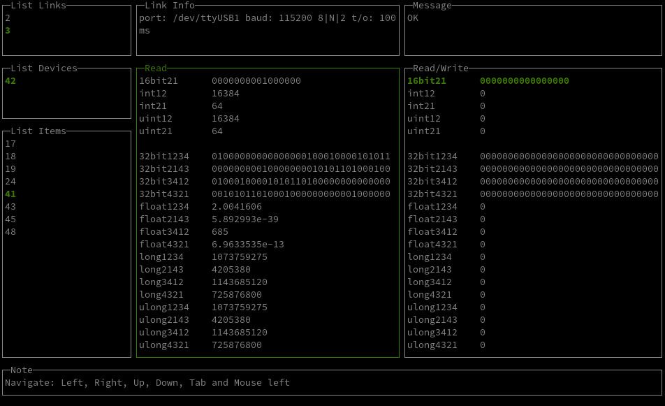

# **Быстрый старт**

----

## **Задача**

Считать данные из устройства по протоколу modbus и отобразить их через веб-интерфейс

----

## **Порядок действий**

1. Установить связь с устройством и считать данные в соответствующем формате
2. Запустить веб-серевр и отобразить данные

У нас в наличии есть контроллер segnetics **SMH2G** c параметрами связи **modbus-tcp** **192.168.22.123:502** и адрессом **73**


который содержит регистры **Input Registers** типа **float** и адрессами **0**,**2**,**4**,**6**


Нам достоверно известно что регистр с адрессом **0** хранит в себе значение **3,1415**...

### **Установка связи**

В этом нам поможет "тестовый" режим. От обычного режима его отличает упрощенный конфигурационный файл.

В нашем случае он будет выглядеть следующим образом:

```json
# easymb --config path/to/config/file.json --monitor
```


Пример:

```shell
# easymb --config path/to/config/file.json --monitor
```


----

## **--test**

Режим тестирования

Пример:

```shell
# easymb --config path/to/config/file.json --test
```



----

## **--version**

Информация о версии приложения

Пример:

```shell
# easymb --version

2020/12/15 14:34:52 Version: v0.9-1-g8509443
Commit: 8509443
Date: 2020-12-14.16:47:49.+0700

```
